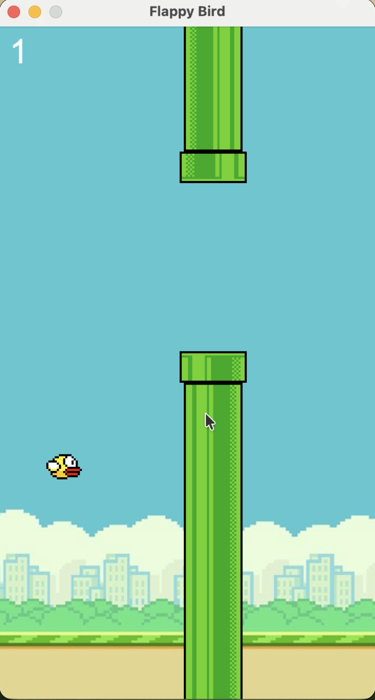

# Flappy Bird Java Game

A simple Java Swing Flappy Bird clone written in plain Java.

## Screenshot



## Project Structure

- `src/`: Java source files
- `src/assets/`: game image assets

## How to Run

From the project root:

```bash
cd /Users/trsk/Downloads/github/FlappyBird
javac src/App.java src/FlappyBird.java
java -cp src App
```

Or from the `src` folder:

```bash
cd /Users/trsk/Downloads/github/FlappyBird/src
javac App.java FlappyBird.java
java App
```

## Start and Controls

- After the window opens, press the `Space` bar to start the game.
- Press `Space` again to make the bird flap and stay between the pipes.

## Notes

- The main entry point is `App.java`.
- Image assets are stored in `src/assets/`.
- Compiled `.class` files are generated in `src/` and are ignored by Git.
